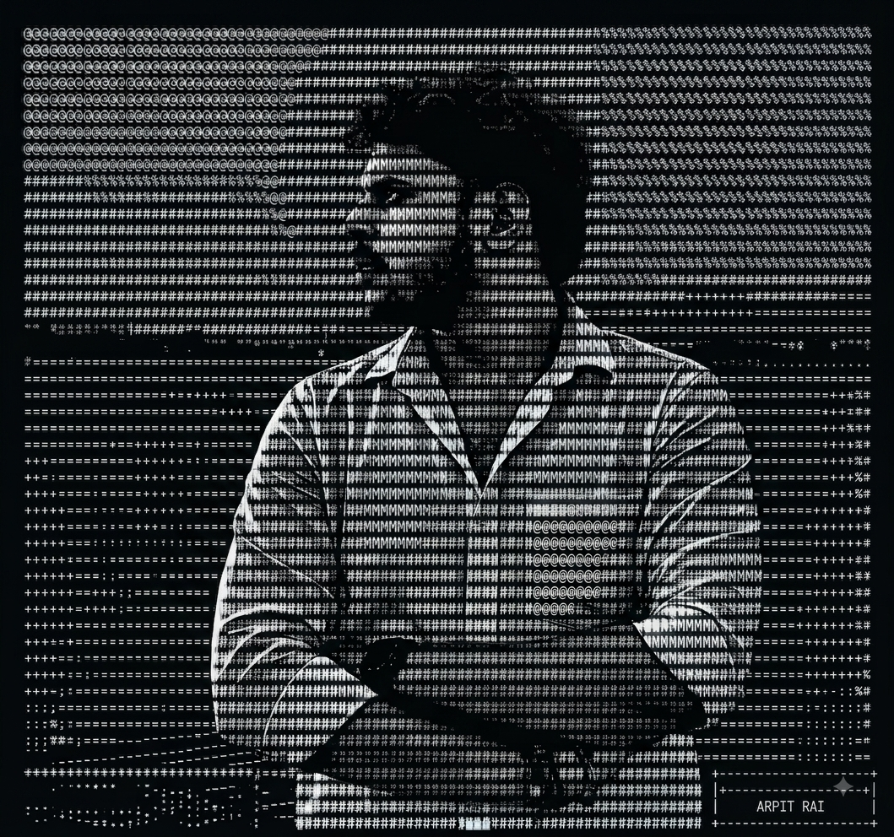

<!-- ========================================================= -->
<!--                 PREMIUM DEVELOPER PROFILE                 -->
<!-- ========================================================= -->

<div align="center">


<br>


<br><br>


</div>

---

<!-- ========================================================= -->
<!--                       INTRODUCTION                         -->
<!-- ========================================================= -->

<div align="center">

## 👨‍💻 Welcome to My Digital Space

### `Developer • Learner • Builder`

<p>
I love transforming ideas into clean, useful and engaging
digital experiences.
</p>

</div>

<br>

<!-- ========================================================= -->
<!--                         PROFILE                            -->
<!-- ========================================================= -->

<table>
<tr>

<td width="42%" align="center" valign="middle">



</td>

<td width="58%" valign="top">

## ✨ About Me

I'm **Arpit Rai**, a Computer Science Engineering student at  
**Institute of Technology and Management (ITM), GIDA, Gorakhpur**.

I'm passionate about **Web Development, Programming,
Problem Solving and building real-world applications**.

### 🎯 Currently Focused On

- 🌐 Modern Web Development
- ⚛️ React & Frontend Development
- 🧠 Data Structures & Algorithms
- 💻 C++ Programming
- 🚀 Full Stack Development
- 🎨 UI/UX and better user experiences
- 🔧 Building practical projects

### 💭 My Development Philosophy

```text
Learn → Build → Debug → Improve → Ship → Repeat
```
</td> </tr> </table>
<!-- ========================================================= --> <!-- DEVELOPER JOURNEY --> <!-- ========================================================= --> <div align="center">
🌱 My Developer Journey
</div> <table> <tr> <td width="33%" align="center" valign="top">
💡 Learn

Understanding technologies,
concepts and fundamentals.

📚

Curiosity drives growth

</td> <td width="33%" align="center" valign="top">
🛠️ Build

Turning ideas into
working applications.

💻

Ideas become products

</td> <td width="33%" align="center" valign="top">
🚀 Improve

Making projects cleaner,
faster and better.

⚡

Never stop improving

</td> </tr> </table>
<!-- ========================================================= --> <!-- CURRENT FOCUS --> <!-- ========================================================= --> <div align="center">
🔭 Currently Exploring
<br>


</div>
<!-- ========================================================= --> <!-- FEATURED PROJECTS --> <!-- ========================================================= --> <div align="center">
🚀 Featured Projects
</div> <table> <tr> <td width="50%" valign="top">
🌍 WanderWise
Bharat Bharaman

A smart travel planning platform designed to help users
explore destinations and plan trips efficiently.

Highlights

🗺️ Travel Planning
💰 Budget-oriented trips
🧳 Destination Exploration
🎨 User-friendly Interface
🚀 Smart Travel Experience

Tech

HTML CSS JavaScript React Node.js

</td> <td width="50%" valign="top">
🎓 Grievance Redressal System

A web-based platform for managing student grievances
and tracking their resolution.

Highlights

📝 Complaint Submission
📊 Complaint Tracking
👨‍💼 Admin Management
🔄 Status Management
💬 Discussion Forum

Tech

React Node.js Express MongoDB

</td> </tr> <tr> <td width="50%" valign="top">
📚 ExamPrep

An examination preparation platform with authentication,
dashboards and question management.

Features

🔐 Authentication
📊 Student Dashboard
📝 Question Bank
📖 Subject Management
👨‍🎓 Examinee Management
🎯 Exam Preparation

Tech

React Node.js Express MongoDB

</td> <td width="50%" valign="top">
✈️ Sarthi
Travel Planner

A travel assistance platform designed to help tourists
plan trips according to their destination and budget.

Features

🗺️ Trip Planning
💰 Budget Planning
🌍 Destination Assistance
🧳 Travel Information

Tech

HTML CSS JavaaScript React

</td> </tr> <tr> <td width="50%" valign="top">
🛒 Zomato-Style Food Platform

A food discovery and ordering interface inspired by
modern food delivery platforms.

Focus

🍔 Restaurant UI
🔍 Search Experience
🏪 Restaurant Cards
📱 Responsive Design

Tech

HTML CSS JavaScript

</td> <td width="50%" valign="top">
🌦️ Weather Application

A weather application that provides weather information
through a clean and simple interface.

Focus

🌤️ Weather Information
🔎 Location Search
📱 Responsive UI
⚡ API Integration

Tech

HTML CSS JavaScript API

</td> </tr> <tr> <td width="50%" valign="top">
💧 Water Reminder

A simple productivity and wellness reminder application
designed to help users remember regular water intake.

Focus

⏰ Reminders
💧 Water Tracking
🎨 Simple UI
📱 Responsive Design

Tech

HTML CSS JavaScript

</td> <td width="50%" valign="top">
🏨 Hotel Management System

A desktop-based hotel management application built
for managing hotel-related operations.

Features

🏨 Room Management
👤 Customer Management
📋 Booking Management
🗄️ Database Integration

Tech

Python Tkinter MySQL

</td> </tr> <tr> <td width="50%" valign="top">
🧠 Amarsadhana

A supportive web platform focused on creating a
positive and engaging digital experience.

Focus

🎨 User Experience
🌐 Web Development
💡 Interactive Content
📱 Responsive Design

Tech

HTML CSS JavaScript

</td> <td width="50%" valign="top">
💻 iCoder

A programmer-focused blog and content platform with
modern Bootstrap-based UI.

Features

📝 Blog Interface
🧭 Navigation
🖼️ Carousel
📱 Responsive Layout
🔐 Login / Signup UI

Tech

HTML CSS Bootstrap JavaScript

</td> </tr> </table>
<!-- ========================================================= --> <!-- PROJECT MINDSET --> <!-- ========================================================= --> <div align="center">
🧩 How I Build Projects
</div>
              💡 IDEA
                 │
                 ▼
          🔎 RESEARCH
                 │
                 ▼
           🎨 DESIGN
                 │
                 ▼
            💻 CODE
                 │
                 ▼
           🐛 DEBUG
                 │
                 ▼
           🧪 TEST
                 │
                 ▼
          🚀 DEPLOY
                 │
                 ▼
          📈 IMPROVE
<!-- ========================================================= --> <!-- SKILLS --> <!-- ========================================================= --> <div align="center">
🛠️ Skills & Technologies
<br>
💻 Programming Languages


<br><br>

🎨 Frontend Development


<br><br>

⚙️ Backend Development


<br><br>

🗄️ Databases


<br><br>

🔧 Development Tools


</div>
<!-- ========================================================= --> <!-- SKILL MATRIX --> <!-- ========================================================= --> <div align="center">
📌 Skill Matrix
</div> <table> <tr> <td width="50%" valign="top">
Frontend
HTML / CSS       ████████████████████ 95%
JavaScript       ██████████████████░░ 90%
React.js         ████████████████░░░░ 85%
Bootstrap        ██████████████████░░ 90%
Tailwind CSS     ███████████████░░░░░ 80%
</td> <td width="50%" valign="top">
Programming & Backend
C++              ████████████████░░░░ 85%
Node.js          ██████████████░░░░░░ 75%
Express.js       ██████████████░░░░░░ 75%
MongoDB          ██████████████░░░░░░ 75%
MySQL            ███████████████░░░░░ 80%
</td> </tr> </table>
<!-- ========================================================= --> <!-- DEVELOPMENT TOOLS --> <!-- ========================================================= --> <div align="center">
🔧 Tools I Use
<table> <tr> <td align="center"> 💻<br> <b>VS Code</b> </td> <td align="center"> 🐙<br> <b>GitHub</b> </td> <td align="center"> 🌿<br> <b>Git</b> </td> <td align="center"> 🚀<br> <b>Postman</b> </td> <td align="center"> 🎨<br> <b>Figma</b> </td> </tr> </table> </div>
<!-- ========================================================= --> <!-- GITHUB ANALYTICS --> <!-- ========================================================= --> <div align="center">
📊 GitHub Analytics
<br>

<!--  -->

<!--  -->

<br><br>

<!--  -->

</div>
<!-- ========================================================= --> <!-- CONTRIBUTION GRAPH --> <!-- ========================================================= --> <div align="center">
📈 Contribution Activity
<br>

<!--  -->

</div>
<!-- ========================================================= --> <!-- TROPHIES --> <!-- ========================================================= --> <div align="center">

## 🏆 GitHub Achievements

<br>

<!--  -->

</div>
<!-- ========================================================= --> <!-- CONNECT --> <!-- ========================================================= --> <div align="center">
🌐 Let's Connect
<p> I'm always open to learning, collaborating and building interesting things. </p> <br> <a href="https://github.com/arpitrai38">


</a>

  

<a href="https://www.linkedin.com/in/arpit-rai-002951292">


</a>

  

<a href="mailto:sadhanamarendra12@gmail.com">


</a> </div>
<!-- ========================================================= --> <!-- FOOTER --> <!-- ========================================================= --> <div align="center">
💙 Thanks for visiting my profile!
<br>


<br><br>


</div> ```

